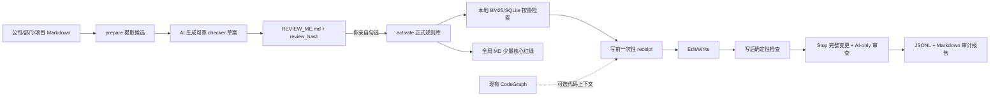

# Java Policy Kit 使用说明（Windows / Codagent）

这套工具把你的 Java 编码、安全、性能和项目 Markdown 规范转换成“先审阅、再激活”的本地规则库，并为 Codagent 安装规范维护、编码执行、最终审查三个 Skill 和三类 Hook。它不会把全部规范塞进上下文，也不会自动修改 Codagent 全局 MD。

日常目标是：Codagent 每写一个逻辑改动单元，先说明是否检索到规范；写后说明实际检查结果；结束前审查完整变更并生成审计报告。



## 0. 使用边界

- 当前首选输入是 `.md`。PDF 请先转成 Markdown 并核对标题、表格和代码块。
- 只有你在 `REVIEW_ME.md` 中明确批准的规则才会激活。
- `prepare` 自动抽取的是候选规则；抽取结果可能有歧义，必须人工审阅。
- `prepare` 会建议规则更适合静态检查、路径检查、配套变更检查还是 AI review，但不会把自然语言猜成可执行正则。等你提供真实规范后，由 Codagent/本项目维护者把能够可靠判断的条款编译成 `metadata.checks` 草案，再重新生成审阅文件；没有具体 checker 配置的规则一律按 AI review 处理，不能伪装成确定性检查。
- 默认使用结构化标签和本地全文索引，不要求 Embedding 模型或向量数据库。主动 JSON 回执去掉重复规则对象，并默认限制在 8000 字符以内。
- CodeGraph 完全可选。本工具不会重新生成你公司的 CodeGraph 索引，也不会因为 CodeGraph 不可用而阻止编码。
- `examples/test-policies/` 全是虚构测试数据，默认不导入、不激活，禁止当作公司规则使用。

## 1. 一次性准备

需要：

- Windows PowerShell 5.1 或 PowerShell 7；
- Python 3.10 或更高版本（能通过 `python --version` 调用）；
- JDK 21；
- Maven；
- 支持 Claude 风格 Skills、Hooks 和全局 MD 的 Codagent。

在项目根目录打开 PowerShell。如公司执行策略阻止本地脚本，只对当前窗口临时放开：

```powershell
Set-ExecutionPolicy -Scope Process Bypass
```

初始化工作目录：

```powershell
.\scripts\policy.ps1 init
```

默认目录约定：

```text
code-write/
├── policykit.json
├── policy-sources/
│   ├── company/
│   ├── department/
│   └── project/
└── .policy-work/
```

如果公司、部门、项目的实际命名不同，可以继续分子目录；导入器会递归读取 Markdown。不要把测试示例复制进 `policy-sources/`。

## 2. 最懒人完整流程

### 第一步：放入真实规范

例如：

```text
policy-sources/
├── company/
│   ├── Java编码规范.md
│   ├── Java安全编码规范.md
│   └── Java高性能编码规范.md
├── department/
│   └── 组内Java约定.md
└── project/
    ├── 项目结构说明.md
    └── 项目开发约定.md
```

不需要先手工拆分规则，也不需要告诉工具一定存在 A→B、文件落位、线程池等规则；文档写了才会形成候选规则。

### 第二步：生成审阅文件

使用默认 `policy-sources/`：

```powershell
.\scripts\policy.ps1 prepare
```

或指定另一个只包含真实规范的目录：

```powershell
.\scripts\policy.ps1 prepare --source "D:\company-java-policies"
```

主要产物位于：

```text
.policy-work/
├── REVIEW_ME.md
├── candidates.json
└── ...
```

### 第三步：只审阅一个文件

打开 `.policy-work/REVIEW_ME.md`。每条规则都有四个选择，只能勾选一个：

```markdown
- [x] 接受并启用 <!-- decision:approved -->
- [ ] 修改后接受 <!-- decision:modified -->
- [ ] 拒绝 <!-- decision:rejected -->
- [ ] 暂不处理 <!-- decision:pending_review -->
```

若选择“修改后接受”，需要在该规则的以下标记之间写入完整的最终规则文本：

```markdown
<!-- POLICYKIT-EDITED:start -->
这里写你确认后的完整规则
<!-- POLICYKIT-EDITED:end -->
```

同一规则多选，或选择“修改后接受”却没有填写内容时，激活会安全失败，不会猜测你的意思。没有勾选的规则按“暂不处理”保留，不会进入正式规则库。

每个审阅块都带有候选正文、范围、严重度和 checker 草案的 `review_hash`。生成审阅文件后如果 `candidates.json` 又发生变化，旧勾选会失效，必须重新运行 `review` 并重新审阅；这能防止“你勾选后内容被悄悄替换”。激活前还会校验 checker 类型、必填字段和正则语法，配置错误时不会降级后偷偷执行。

如果这次由 Codagent 使用 `java-policy-authoring` Skill 为可靠条款生成了 checker 草案，它会先运行：

```powershell
.\scripts\policy.ps1 review
```

然后 checker 的完整 JSON 会直接显示在同一个 `REVIEW_ME.md` 中供你一起审阅。普通 `prepare` 不会擅自把自然语言猜成正则；没有具体 checker 草案的规则将明确标为只按需检索和 AI review。

重点检查：

- 原文来源和章节是否正确；
- 强制、建议、禁止的语气是否被准确保留；
- 公司、部门、项目范围是否正确；
- 自动检查候选是否真的能确定性判断；
- 若条目显示了 checker 草案，其模式、适用路径和严重级别是否准确；
- 潜在冲突和含糊条款是否需要人工修改或暂缓。

### 第四步：激活批准规则

```powershell
.\scripts\policy.ps1 activate --review ".policy-work\REVIEW_ME.md"
```

激活后生成：

```text
.policy-work/
├── approved-rules.json
├── search-index.db
└── GLOBAL_MD_BLOCK.md
```

只有明确批准或按要求修改后批准的规则会进入 `approved-rules.json`。

### 第五步：安装到 Codagent

默认假设 Codagent 用户目录是 `%USERPROFILE%\.codagent`，运行时安装到 `%LOCALAPPDATA%\CodagentJavaPolicy`：

```powershell
.\scripts\install.ps1
```

路径不同就显式指定：

```powershell
.\scripts\install.ps1 `
  -CodagentHome "D:\tools\codagent-home" `
  -InstallRoot "D:\tools\codagent-java-policy"
```

安装器会：

- 使用版本化目录保存运行时；
- 要求 `InstallRoot` 是空目录或带本工具 owner marker 的专属目录，拒绝占用共享工具目录；
- 把插件放入 `<CodagentHome>\plugins\java-policy-kit`；
- 为当前绝对路径生成 `hooks.json`；
- 若升级，只有添加 `-Update` 才会继续，并在替换插件前备份旧版本；
- 不修改全局 MD、Codagent settings 或其他用户文件；
- 遇到同名但不属于本工具的插件目录时拒绝覆盖。

### 第六步：复制全局 MD 区块

安装完成后终端会打印 `GLOBAL_MD_BLOCK.md` 的绝对路径。打开它，把 `CODAGENT-JAVA-POLICY:START` 到 `CODAGENT-JAVA-POLICY:END` 整段复制进公司的 Codagent 全局 MD。

不要复制原始规范全文。全局 MD 只放执行流程和少量经批准的核心规则，其余规则由 Skill 按需检索。

### 第七步：自检

```powershell
.\scripts\doctor.ps1 -RequireActivated
```

如果使用自定义 Codagent 路径：

```powershell
.\scripts\doctor.ps1 -CodagentHome "D:\tools\codagent-home" -RequireActivated
```

CodeGraph 未配置只会显示提示，不会判失败。

## 3. 日常怎么用

安装后继续按原来的 vibe coding 或 SDD 方式给 Codagent 下任务，不必每次补一句“请遵守规范”。全局 MD、Skill 和 Hook 会要求它执行：

1. 每个逻辑改动单元写入前，按任务、文件路径、代码/API 特征查询已批准规则；
2. 在聊天里显示“命中规则 / 已检索无专门规则 / 检索失败”；
3. 写入后运行检查，并显示“确定性检查 / AI 审查”的真实状态；
4. 发现阻断问题后自行修复并重新检查；
5. 任务结束前检查完整变更并写审计记录。

在 Hook 正常启动并于宿主超时前返回的范围内，默认按 fail-closed 工作：当目标文件没有有效的一次性 receipt 时，第一次 `Edit/Write` 提议会被 `PreToolUse` 正常拒绝，同时把本次命中的规则返回给 Codagent。Codagent 应先在聊天中报告依据，再重试；第二次才进行真实写入。写后 receipt 被消费，下一次逻辑修改会重新取证。这是预期的追踪机制，不代表安装故障。

默认还会在结束时为命中的 AI-only 规则设置审查闸门：Codagent 必须逐条对照最终变更，并在最终回复的 `last_assistant_message` 中写出每个规则 ID 和“审查通过 / 已修复 / 仅建议，无阻断”的明确结论。Hook 会保存命中的规则 ID 和这段自述证据的 SHA-256（不保存完整回复）后才允许结束；它仍属于“AI 自述已审查”，不能冒充正则、编译器或静态分析器的确定性通过。

默认 `blocker` 和 `major` 的确定性检查失败都会阻断；`advisory` 失败不会伪装成通过，而会作为非阻断问题显示并写入审计。

为避免绕过审计，Skill 禁止用 Shell 重定向、Python/Node 写文件脚本直接修改受管文件；Hook 也会拦截常见写法并要求改用 `Edit/Write/MultiEdit`。任意外部程序的副作用无法仅靠 Claude 风格 Hook 完全证明，因此这套工具是工程护栏与证据链，不是操作系统级防篡改沙箱。

Claude 风格的外部 command Hook 还有宿主边界：命令若超时，官方宿主通常不会用超时结果阻断工具调用。本安装器会把 Python/脚本启动失败转换为 `exit 2`，但无法把宿主超时变成强制拒绝。因此“fail-closed”不是安全沙箱承诺；若公司 Codagent 支持进程内权限回调或托管策略插件，生产强化时应把 Pre 检查迁入该机制。

“逻辑改动单元”通常是一个方法、类、配置或一组不可分割的多文件修改。聊天按逻辑单元汇报，底层审计按实际 Hook/Edit 事件留痕，避免按每一行刷屏。

四种常见状态要这样理解：

| 状态 | 含义 |
|---|---|
| 规范命中并验证通过 | 找到了已批准规则，适用的实际检查也通过 |
| 规范命中，仅 AI 审查 | 找到规则，但当前没有可靠的程序化检查器 |
| 已检索，无专门规范 | 确实查询过，规则库没有当前场景的专门规定 |
| 检索或检查失败，已阻断 | 不能证明规范流程完成，Codagent 不应继续结束任务 |

## 4. 查看“它每次到底干了什么”

查看安装后 Codagent 实际产生的最近会话报告：

```powershell
.\scripts\policy.ps1 -Installed report
```

指定会话：

```powershell
.\scripts\policy.ps1 -Installed report --session "<会话 ID>"
```

`-Installed` 会从 `<CodagentHome>\plugins\java-policy-kit\.policykit-install.json` 自动定位当前版本化运行时。自定义 Codagent 目录时追加 `-CodagentHome "D:\tools\codagent-home"`。

安装后的审计和检索回执默认保存在 `%LOCALAPPDATA%\CodagentJavaPolicy\releases\<版本>\.policy-work\`；未安装前的本地演练才保存在源码根目录：

```text
.policy-work/
├── receipts/
└── audit/
```

报告应区分：检索命中的规则、没有专门规则的修改、只能 AI 审查的规则、确定性检查结果、修复记录和最终未解决项。不要仅凭聊天中的一句“已遵守规范”作为证据。

也可以手工验证一次检索：

```powershell
.\scripts\policy.ps1 search `
  --query "Spring MVC 中捕获异常并记录日志" `
  --file "src/main/java/com/example/web/UserController.java" `
  --json
```

若 Codagent 能把真实会话 ID 暴露给 Skill，它会在写入前主动生成一次性 receipt；否则 `PreToolUse` 会通过“首次阻断、第二次重试”完成同样的取证。人工试查不应伪造会话凭据。

## 5. CodeGraph（可选）

如果公司的 Codagent 已经连接现有 CodeGraph 索引，不需要本工具重新建索引。`java-policy` Skill 会在“查询相似实现、调用关系或修改影响范围确实有帮助”时使用当前可用工具。

三条原则：

- CodeGraph 不可用时跳过，不阻断规范检索和检查；
- 没有实际调用就必须报告“跳过/不可用”，不能虚构结果；
- CodeGraph 回答“项目现在怎么写”，Policy Kit 回答“公司要求怎么写”，两者不能互相替代。

`examples/codegraph.optional.example.yaml` 只是对接占位示例，当前 MVP 不会自动加载它。到公司后如需固定工具名，再根据 Codagent 实际 MCP/Skill 接口做适配。

## 6. 规范更新

把新版本 Markdown 放入 `policy-sources/` 后，重新执行：

```powershell
.\scripts\policy.ps1 prepare
# 只审阅新的 REVIEW_ME.md
.\scripts\policy.ps1 activate --review ".policy-work\REVIEW_ME.md"
.\scripts\install.ps1 -Update
```

升级会先备份已安装插件，不会编辑你的全局 MD。随后人工替换全局 MD 中带标记的旧区块。

每次升级使用新的版本化运行时；`-Installed report` 只指向当前版本。旧版本的审计不会删除，仍保存在旧的 `%LOCALAPPDATA%\CodagentJavaPolicy\releases\<版本>\.policy-work\audit\` 中，需要追溯跨版本历史时按该路径查看。

## 7. 卸载与恢复

只停用插件、保留运行时和审计：

```powershell
.\scripts\uninstall.ps1
```

同时把运行时移动到可恢复目录：

```powershell
.\scripts\uninstall.ps1 -IncludeRuntime
```

卸载脚本不直接删除数据，而是移动到带时间戳的备份目录；`-IncludeRuntime` 只有在 `InstallRoot` 存在本工具 owner marker 时才会移动整棵目录，避免误搬共享目录。脚本也不会改全局 MD。最后请人工删除全局 MD 中的 `CODAGENT-JAVA-POLICY` 标记区块。

## 8. 常见问题

### Codagent 没有自动加载插件

先确认公司的魔改版是否仍从 `<CodagentHome>\plugins` 发现插件。如果目录或注册方式不同，用 `-CodagentHome` 指向实际位置；若还需要内部 marketplace/白名单注册，按公司的 Codagent 文档注册 `java-policy-kit`，不要手改生成的 Hook 命令。

### Hook 提示找不到 Python 或模块

用实际 Python 命令重新安装，例如：

```powershell
$env:POLICYKIT_PYTHON = "C:\Python312\python.exe"
.\scripts\install.ps1 -Update
```

然后运行 `doctor.ps1`。

### 检索到了错误或过时规则

不要让 Codagent继续声称合规。回到 `REVIEW_ME.md` 修正规则范围或拒绝该项，重新激活并 `install.ps1 -Update`。

### 没找到专门规则，还能写代码吗

可以，但必须明确显示“已检索，无专门规范”，并依据项目现有实现与 Java 21/Spring MVC 通用实践。若规范检索本身失败，则不能按同样方式绕过。

### 需要 Embedding 模型吗

第一版不需要。真实规范导入后如果本地全文检索对抽象表述明显漏召回，再评估公司批准的本地 Embedding 模型；这不影响当前安装包和审阅流程。
