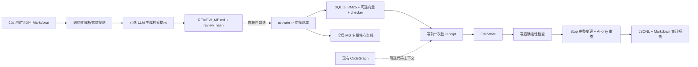

# Java Policy Kit 使用说明（Windows / Codagent）

这套工具把你的 Java 编码、安全、性能和项目 Markdown 规范转换成“先审阅、再激活”的本地规则库，并生成规范维护、编码执行、最终审查三个 Skill 和三类 Hook。推荐采用“导出后手工部署”：工具只生成一个完整目录，绝不修改 Codagent；你按清单把 Skill、全局 MD 标记块和 Hook 分别合并到公司的 Codagent。

第一次使用、希望逐步照着操作时，请先看 [README.md：Java Policy Kit 保姆级使用教程](README.md)。本文继续保留完整设计、执行边界、部署、审计和维护说明。

日常目标是：Codagent 每写一个逻辑改动单元，先说明是否检索到规范；写后说明实际检查结果；结束前审查完整变更并生成审计报告。

快速导航：

- 想先理解整体流程：看“先看这里”和第 0 节；
- 想在页面上亲自试：看第 2 节的“页面完整操作示例”；
- 准备把公司规范正式接入：从第 1 节开始顺序执行；
- 准备复制到 Codagent：重点看第 3 节第六、七步；
- 想知道 Codagent 日常应该怎样反馈：看第 4 节三个对话示例；
- 想查看每次做了什么：看第 5 节；
- 规范升级或回滚：看第 7、8 节；
- 出现故障：看第 9 节；
- 正式上线前验收：逐项勾选第 10 节。



## 先看这里：实际要做的只有三类事情

| 什么时候 | 你要做什么 | 频率 |
|---|---|---|
| 第一次接入 | 启动页面，上传真实规范，审批候选规则，激活并导出部署包 | 一次 |
| 日常开发 | 像平时一样给 Codagent 下 vibe coding 或 SDD 任务 | 每天；不需要手工搜规范 |
| 规范更新 | 重新上传或替换 Markdown，审批变化，激活新版本并重新导出 | 规范变化时 |

推荐路线始终是：

```text
在 code-write 源码仓库维护规范
    → 用 Policy Studio 审批和测试
    → 激活正式规则库
    → 导出到一个长期不移动的 release 目录
    → 手工合并 Skill、全局 MD 标记块和 Hook
    → 用一个小型 Java 修改做验收
```

如果你只是想先看看页面和检索效果，读第 2 节即可。如果准备在公司正式部署，按第 1、2、3 节依次执行。部署完成后的开发人员主要看第 4、5 节；维护规范时再看第 7 节。

### 三个容易混淆的文件

| 文件 | 用途 | Codagent 编码时是否读取 |
|---|---|---|
| 原始规范 Markdown | 公司、部门和项目的权威来源 | 否 |
| `REVIEW_ME.md` | 自动抽取后的候选规则审批记录 | 否，只在规则维护时由人查看 |
| `approved-rules.json` + `search-index.db` | 已批准的正式规则与运行时索引 | 是，按每个逻辑改动单元检索 |

因此，不要把原始规范或 `REVIEW_ME.md` 整份塞进全局 MD。全局 MD 只负责要求 Codagent 执行流程，真正的规范内容由正式索引按需返回。

## 0. 使用边界

- 当前首选输入是 `.md`。PDF 请先转成 Markdown 并核对标题、表格和代码块。
- Markdown 必须是 UTF-8。Policy Studio 单文件上限 1 MiB、单次最多选择 32 个文件、整个请求体上限 4 MiB；较大的规范请按章节拆分并分批导入。
- 只有你在 `REVIEW_ME.md` 中明确批准的规则才会激活。
- `prepare` 自动抽取的是候选规则；抽取结果可能有歧义，必须人工审阅。
- `prepare` 会建议规则更适合静态检查、路径检查、配套变更检查还是 AI review，但不会把自然语言猜成可执行正则。等你提供真实规范后，由 Codagent/本项目维护者把能够可靠判断的条款编译成 `metadata.checks` 草案，再重新生成审阅文件；没有具体 checker 配置的规则一律按 AI review 处理，不能伪装成确定性检查。
- `规则编号 + 【级别】/【描述】/【反例】/【正例】` 会被解析为一条完整规则，字段和代码样例都会参与检索并随命中结果返回，不再把标题拆成一个短词候选。
- 默认使用本地 BM25，不要求联网。可选 OpenAI/OpenAI-compatible LLM 只生成检索意图、别名和代码信号，可选 Embedding 与 BM25 融合；两者都按规则内容哈希缓存，未变化的规则不会重复生成。
- AI 不会批准规则、改写权威正文或自动创造确定性 checker。主动 JSON 回执去掉重复规则对象，并默认限制在 8000 字符以内。
- 激活后可选把完整规则和向量镜像到本地 SQLite；`RuleDatabasePort`/`custom_factory` 给 MySQL、PostgreSQL 或向量库适配器预留了接口。正式运行时仍以经过 `bundle_id` 校验的 JSON + 索引为准。
- CodeGraph 完全可选。本工具不会重新生成你公司的 CodeGraph 索引，也不会因为 CodeGraph 不可用而阻止编码。
- 公司、部门、项目三个层级目前没有“项目规则自动覆盖公司规则”的隐式优先级。若多个层级存在冲突，检索可能同时返回；必须在审批阶段拒绝错误条款、补全适用边界或让规范负责人确认，冲突未解决不要激活。
- `examples/test-policies/` 全是虚构测试数据，默认不导入、不激活，禁止当作公司规则使用。

## 1. 一次性准备

需要：

- Windows PowerShell 5.1 或 PowerShell 7；
- Python 3.10 或更高版本（能通过 `python --version` 调用）；
- JDK 21；
- Maven；
- 支持 Claude 风格 Skills、Hooks 和全局 MD 的 Codagent。

公司的 Codagent 是魔改版本，它的全局 Skill 目录、全局 MD 文件和 Hook 配置位置不能从 Claude Code 的默认路径直接推断。部署前必须从公司文档、Codagent 设置页或现有配置中确认三个真实位置；本手册不会假设它们一定在 `%USERPROFILE%\.codagent`。

在项目根目录打开 PowerShell。如公司执行策略阻止本地脚本，只对当前窗口临时放开：

```powershell
Set-ExecutionPolicy -Scope Process Bypass
```

初始化工作目录：

```powershell
.\scripts\policy.ps1 init
```

默认目录约定：

```text
code-write/
├── policykit.json
├── policy-sources/
│   ├── company/
│   ├── department/
│   └── project/
└── .policy-work/
```

如果公司、部门、项目的实际命名不同，可以继续分子目录；导入器会递归读取 Markdown。不要把测试示例复制进 `policy-sources/`。

## 2. Policy Studio 页面（推荐）

在 Java Policy Kit 源码仓库根目录运行：

```powershell
.\scripts\policy.ps1 ui
```

默认只监听 `127.0.0.1:8765` 并打开浏览器。Studio 不提供远程管理认证，因此服务端会直接拒绝 `0.0.0.0`、局域网 IP 或其他非回环地址。终端保持运行，使用完按 `Ctrl+C` 停止。端口被占用或不想自动打开浏览器时：

```powershell
.\scripts\policy.ps1 ui --port 8899 --no-open
```

页面提供一条完整的可视化测试链路：

1. 选择公司级、部门级或项目级范围，拖入一个或多个 `.md/.markdown` 文件；成功后分别写入 `policy-sources/company`、`policy-sources/department` 或 `policy-sources/project`。同名文件不会被静默覆盖。
2. 点击“生成候选规则”，得到与命令行相同的 `candidates.json` 和 `REVIEW_ME.md`。
3. 在“候选规则审批台”查看来源原文、级别、完整描述、反例、正例、严重度、置信度和 checker 草案。可逐条处理，也可先筛选再一次批量批准当前待处理项；批量操作不会覆盖已有决定。
4. 页面每次保存都会原子更新真实 `REVIEW_ME.md`；候选内容发生变化时，旧页面的 `review_hash` 会失效；同一规则若已被另一个页面更新，旧的 `decision_hash` 也会阻止后保存者静默覆盖。
5. 确认版本号后激活。只有批准或修改后接受的规则进入 `approved-rules.json` 和 `search-index.db`；两者带同一 `bundle_id`，不一致时页面、命令行和 Hook 都会 fail-closed。
6. 在“索引检索沙盒”输入开发意图、目标 Java 文件和可选代码片段。页面调用与 Codagent Hook 相同的运行时入口，在已激活索引上合并 BM25、可选向量相似度与 path/checker 适用性，并查看分数、命中原因、级别、描述和正反例。
7. “原始 REVIEW_ME”页签可查看和复制底层 Markdown，便于 Git diff、归档或脱离页面继续人工审阅。

页面完全复用命令行的抽取、审批哈希、checker 校验、激活和运行时召回代码；它不是另一套规则库。所有写接口只接受本页面发送的 JSON 请求，服务只允许本机回环访问，也不会连接外部 CDN。

### 页面完整操作示例

下面只演示操作方式，内容是虚构规则，不能当作公司正式规范。如果要亲自试跑，请在单独的仓库副本中使用；正式环境直接换成你的真实 Markdown。

假设上传的 `Java测试规范.md` 内容如下：

```markdown
# Java 测试规范

## 不可变 Map
当 Map 的 value 可能为 null 时，禁止直接调用 Map.of；必须先处理空值。

## 异常日志
捕获 Exception 后必须使用项目日志组件记录异常堆栈，禁止静默吞掉异常。

## 线程创建
业务代码禁止直接 new Thread，必须使用项目统一管理的线程池。
```

在页面中按下面顺序操作：

1. 启动 `Policy Studio`，在“文档范围”下拉框中选择“公司级”。
2. 点击“选择 .md 文件”，选择 `Java测试规范.md`，再点击“导入选中文档”。
3. 页面提示导入成功后，点击“生成候选规则”。
4. 在“候选规则审批台”打开每张卡片，核对来源文件、章节、正文和适用范围。
5. 把“不可变 Map”和“异常日志”设为“批准”；把“线程创建”设为“暂缓”，并保存决定。
6. 打开“原始 REVIEW_ME”，确认前两条显示接受、第三条仍为暂缓。这里看到的是审批记录，不是 Codagent 的运行时上下文。
7. 进入“激活规则”，版本号填写 `demo-2026-08-v1`，点击“确认并激活规则库”。页面应显示正式索引可用、已批准规则数为 2；暂缓规则不应进入索引。
8. 进入“索引检索沙盒”，按下表填写并查询。

| 输入项 | 示例值 |
|---|---|
| 开发意图 | `在订单查询接口中用 Map.of 返回可能为空的订单备注` |
| 目标文件 | `src/main/java/com/acme/order/web/OrderController.java` |
| 代码片段 | `return Map.of("remark", order.getRemark());` |
| 范围、分类 | 第一次测试先留空 |
| 最大结果数 | `10` |

预期现象：结果中应出现“value 可能为 null 时禁止直接调用 `Map.of`”这一条，并能看到来源 `company/Java测试规范.md`、原文行号和命中原因。规则 ID、分数和排序可能随真实文档变化，不要求与示例完全一致；需要确认的是“召回的规则正确、来源可追溯、暂缓规则没有出现”。

再做两个反向测试：

- 查询“捕获 Exception 后什么也不做”，应命中异常日志规则。
- 查询“业务代码 new Thread”，不应命中暂缓的线程创建规则。若暂缓规则出现，说明激活结果不正确，不要继续部署。

### 四种审批决定怎么选

| 决定 | 什么时候选 | 示例 |
|---|---|---|
| 批准 | 抽取文本、适用范围和强制程度都与原文一致 | 原文和候选都明确要求捕获异常后记录堆栈 |
| 修改后接受 | 规则方向正确，但抽取丢失条件、例外或表述不够准确 | 候选写成“禁止使用 Map.of”，实际应为“value 可能为空时禁止直接使用” |
| 拒绝 | 抽到的是背景说明、反例、重复条款或错误内容 | 文档中的错误示例被误识别为强制规范 |
| 暂缓 | 目前无法确认含义、范围或执行方式 | 线程池名称尚未确定，需要询问部门负责人 |

选择“修改后接受”时，要写完整的最终规则，不能只写“加上空值判断”这种修改意见。例如：

```text
错误写法：加上空值判断。

正确写法：当传给 Map.of/Map.ofEntries 的 key 或 value 可能为 null 时，
必须先完成空值处理；无法证明非空时不得直接调用。
```

激活前至少应批准一条规则。零条批准规则会被拒绝，防止误操作把已有正式规则库清空。

### 公司、部门、项目规则冲突怎么办

系统不会自动应用“项目级覆盖部门级、部门级覆盖公司级”。例如：

```text
公司规则：所有 Controller 禁止捕获 Exception，统一交给全局异常处理器。
项目规则：支付回调 Controller 必须捕获验签异常并记录审计日志。
```

如果两条原样批准，Codagent 可能同时召回并无法判断优先级。正确做法是让规范负责人确认后，把边界写进最终文本和适用路径，例如：公司规则明确排除支付回调目录，项目规则只适用于 `**/payment/callback/**/*Controller.java`。也可以拒绝已过时的一条。不要依赖 scope 名称自动覆盖，也不要在冲突未解决时同时激活。

### 检索结果怎么看

每张结果卡至少回答四个问题：

1. **命中了什么**：最终批准的规则正文，而不是原始文档整页内容。
2. **为什么命中**：任务文本相关、代码/API 相关，或者目标路径/checker 直接适用。
3. **来自哪里**：规范层级、文件、章节和行号，方便回到权威原文核对。
4. **怎么执行**：有可靠 checker 时显示直接适用的检查器；没有时明确标为 AI review。

“范围过滤”只接受 `company`、`department`、`project`，多个值用英文逗号分隔；“分类过滤”应填写候选卡片上实际显示的分类值，不要自行翻译或猜测。第一次验收建议都留空，确认基础召回正常后再测试过滤。结果分数只用于**同一次查询中的相对排序**，不是合规分、质量分或通过阈值，不应拿不同查询的分数横向比较。

搜索没有结果不等于系统故障。先换成接近真实开发的完整输入——任务意图、目标路径和代码片段一起填写；仍无结果时，再核对规则是否已批准、激活版本是否正确。页面如果显示索引不可用、`bundle_id` 不一致或规则包被修改，则属于系统故障，会拒绝搜索，必须先重新激活，不能把它解释成“没有专门规范”。

### 为什么还需要 REVIEW_ME

`REVIEW_ME.md` 不是 Codagent 日常写代码时要读取的规范，而是候选规则进入正式索引前的一次人工准入记录。自动抽取可能误解说明文字、例外条件、严重度或适用范围；如果没有这道闸门，AI 检索得越频繁，错误规则造成的影响反而越大。

运行时只读取已批准规则和正式索引。检索粒度也不是“每写一行”：一次 `Edit/Write` 通常对应一个方法、配置或逻辑改动单元，Hook 会在真实写入前检索并发放一次性凭据，写入后再检查。逐行重复搜索只会增加延迟和重复上下文，不会提高规则准确度。

> Policy Studio 用于维护源码规则库。不要在已经导出的固定 `runtime` 目录中导入和更新规范；更新完成后应从源码仓库重新导出一个新的手工部署 release。

## 3. 命令行完整流程

### 第一步：放入真实规范

例如：

```text
policy-sources/
├── company/
│   ├── Java编码规范.md
│   ├── Java安全编码规范.md
│   └── Java高性能编码规范.md
├── department/
│   └── 组内Java约定.md
└── project/
    ├── 项目结构说明.md
    └── 项目开发约定.md
```

不需要先手工拆分规则，也不需要告诉工具一定存在 A→B、文件落位、线程池等规则；文档写了才会形成候选规则。

#### 什么样的 Markdown 更容易准确抽取

建议一条规则表达一个完整约束，并写清“触发条件 + 必须/禁止的行为 + 例外 + 适用路径（如有）”。例如：

```markdown
## Controller 异常处理

- 当 Spring MVC Controller 捕获 Exception 时，必须使用项目日志组件记录异常对象；
  禁止只记录 `exception.getMessage()`，禁止空 catch。
- 本规则适用于 `**/*Controller.java`；由全局异常处理器统一处理且当前方法没有 catch 时不适用。
```

下面这种写法不利于抽取：

```markdown
异常处理要合理。日志也要注意。之前出现过不少问题，大家按实际情况处理。
```

不要为了迎合抽取器而删掉原规范中的例外条件；条件和例外恰恰决定规则是否会误报。很长的章节可以拆成多个 Markdown 文件，但要保留清晰标题和权威来源信息。

#### 推荐的结构化规则格式

下面这种格式会作为一个整体解析，规则 ID 原样保留；描述和正反例不会再被丢掉：

````markdown
### 3.12.3 G.EDV.02 禁止直接使用外部数据构造格式化字符串

**【级别】** 要求

**【描述】**
格式模板必须由程序定义，外部数据只能作为待格式化参数。

**【反例】**
```java
String.format(request.getParameter("format"), value);
```

**【正例】**
```java
String.format("%s", value);
```
````

仓库中的 `examples/test-policies/Java结构化编码规范-仅测试.md` 提供了四条完整测试规则，分别覆盖小驼峰变量、顶层 public 类型 Javadoc、外部数据反序列化和外部格式化字符串。它仅用于测试，不能作为公司规则激活。

### 第二步：生成审阅文件

使用默认 `policy-sources/`：

```powershell
.\scripts\policy.ps1 prepare
```

或指定另一个只包含真实规范的目录：

```powershell
.\scripts\policy.ps1 prepare --source "D:\company-java-policies"
```

重复执行会自动保留内容未变化规则的决定。如果 CLI 检测到已批准、修改、拒绝或带备注的规则已变化/删除，会先退出而不覆盖审阅文件；核对差异并确认丢弃这些过期决定后，再显式运行：

```powershell
.\scripts\policy.ps1 prepare --reset-decisions
```

主要产物位于：

```text
.policy-work/
├── REVIEW_ME.md
├── candidates.json
└── ...
```

### 第三步：集中审阅 REVIEW_ME 一个文件

打开 `.policy-work/REVIEW_ME.md`。每条规则都有四个选择，只能勾选一个：

```markdown
- [x] 接受并启用 <!-- decision:approved -->
- [ ] 修改后接受 <!-- decision:modified -->
- [ ] 拒绝 <!-- decision:rejected -->
- [ ] 暂不处理 <!-- decision:pending_review -->
```

若选择“修改后接受”，需要在该规则的以下标记之间写入完整的最终规则文本：

```markdown
<!-- POLICYKIT-EDITED:start -->
这里写你确认后的完整规则
<!-- POLICYKIT-EDITED:end -->
```

同一规则多选，或选择“修改后接受”却没有填写内容时，激活会安全失败，不会猜测你的意思。没有勾选的规则按“暂不处理”保留，不会进入正式规则库。

每个审阅块都带有候选正文、范围、严重度和 checker 草案的 `review_hash`。再次执行 `prepare` 或 `review` 时，内容指纹未变化的规则会自动保留原决定、修改正文和备注；新增规则保持待处理。只有规则被修改或删除时，对应旧决定才会失效并要求一次确认，这能防止“你勾选后内容被悄悄替换”，同时避免每次全量重选。激活前还会校验 checker 类型、必填字段和正则语法，配置错误时不会降级后偷偷执行。

如果这次由 Codagent 使用 `java-policy-authoring` Skill 为可靠条款生成了 checker 草案，它会先运行：

```powershell
.\scripts\policy.ps1 review
```

然后 checker 的完整 JSON 会直接显示在同一个 `REVIEW_ME.md` 中供你一起审阅。普通 `prepare` 不会擅自把自然语言猜成正则；没有具体 checker 草案的规则将明确标为只按需检索和 AI review。

#### 首次建库时怎样生成 checker 草案

页面的“生成候选规则”只做保守抽取，不会自动创造硬规则 checker。这是有意设计，避免把自然语言误编译成容易误报的正则。

第一次还没有正式部署三个 Skill 时，二选一：

- 让当前维护代理直接读取源码仓库中的 `codagent-plugin\skills\java-policy-authoring\SKILL.md`，按其中流程工作；
- 或临时只把 `java-policy-authoring` Skill 复制到 Codagent 的实际 Skill 目录，完成首次建库后，再用正式 release 中的三个 Skill 替换。

可以把下面任务原样交给已经能使用 `java-policy-authoring` 的 Codagent：

```text
请使用 java-policy-authoring Skill 维护当前 Java Policy Kit 规则库。

输入是 policy-sources 下的公司、部门、项目 Markdown：
1. 先运行 prepare，保留每条候选的来源、章节和行号。
2. 逐条判断能否由现有 checker 稳定、低误报地验证。
3. 只为可确定判断的条款，在 candidates.json 对应规则的 metadata.checks 中生成草案；
   复杂控制流、空值来源、跨方法数据流和业务语义保留为 ai_review，不要伪造硬检查。
4. 每个硬 checker 至少准备一个应通过和一个应失败的最小样例，并实际验证。
5. 运行 policy.ps1 review，把 checker JSON 重新写入 REVIEW_ME.md。
6. 最后报告：候选总数、硬 checker 数、AI review 数、冲突/重复项和正反例结果。

不要替我勾选 REVIEW_ME，不要运行 activate，不要修改 approved-rules.json。
```

常见规则与 checker 的对应关系：

| 规则示例 | 推荐处理 | 原因 |
|---|---|---|
| 禁止 `new Thread(...)` | `regex_forbid` | 是稳定的局部语法特征 |
| Controller 只能放在指定模块 | `path_allow` / `path_forbid` | 能由目标文件路径确定 |
| 修改 A 文件时本次变更必须同时修改 B 文件 | `companion_change` | 能检查同一变更集合；不能证明磁盘上早已存在 B |
| 每个 catch 都必须正确打印异常堆栈 | 默认 `ai_review` | 普通正则不理解 Java 块级作用域；有公司 AST 检查器时再接入 |
| `Map.of` 的 value 可能为空时必须处理 | 默认 `ai_review` | “是否可能为空”涉及数据流，文本正则无法可靠证明 |

authoring 完成后，`candidates.json` 的 `metadata.checks` 会出现草案，重新生成的 `REVIEW_ME.md` 会展示 checker JSON；正式 `approved-rules.json` 和索引此时仍不会变化。只有你亲自审批并执行激活后，草案才可能进入正式规则库。

重点检查：

- 原文来源和章节是否正确；
- 强制、建议、禁止的语气是否被准确保留；
- 公司、部门、项目范围是否正确；
- 自动检查候选是否真的能确定性判断；
- 若条目显示了 checker 草案，其模式、适用路径和严重级别是否准确；
- 潜在冲突和含糊条款是否需要人工修改或暂缓。

### 第四步：激活批准规则

```powershell
.\scripts\policy.ps1 activate `
  --review ".policy-work\REVIEW_ME.md" `
  --policy-version "company-java-2026.08-v1"
```

激活后生成：

```text
.policy-work/
├── approved-rules.json
├── search-index.db
└── GLOBAL_MD_BLOCK.md
```

只有明确批准或按要求修改后批准的规则会进入 `approved-rules.json`。

`GLOBAL_MD_BLOCK.md` 不会塞入全部正式规则。默认只从已批准规则中选择：显式标记 `metadata.global_core: true` 的规则，以及没有显式排除且属于非项目级的 `blocker`；默认最多 40 条。普通规则仍在正式索引中按需检索。把标记块合并进 Codagent 前必须人工阅读，确认没有把范围过窄或有例外的条款放进全局上下文。

### 可选：启用大模型检索增强与向量

推荐保留“确定性结构化解析 + BM25”为基础，再把大模型用于低频建索引，而不是让大模型替你审批或改写规则：

1. `prepare` 时，大模型只为新增或变化规则生成 `retrieval_intent`、别名、代码信号和触发词；结果缓存在 `.policy-work/ai-enrichment-cache.json`。
2. `activate` 时，把完整的 title、规则正文、描述、正反例和检索提示一起 Embedding；结果缓存在 `.policy-work/embedding-cache.json`。
3. 日常搜索把任务、文件路径和代码片段生成一个查询向量，与 BM25 分数融合。API 不可用且 `required=false` 时自动回退 BM25；规则正文和人工审批不受影响。

先在当前 PowerShell 会话设置密钥，不要把密钥写入 `policykit.json` 或提交到 Git：

```powershell
$env:OPENAI_API_KEY = "你的密钥"
```

再修改 `policykit.json` 的 `ai` 部分：

```json
{
  "ai": {
    "provider": "openai",
    "base_url": "https://api.openai.com/v1",
    "api_key_env": "OPENAI_API_KEY",
    "required": false,
    "llm": {
      "enabled": true,
      "model": "<填写当前账号可用的文本模型>",
      "batch_size": 12
    },
    "embedding": {
      "enabled": true,
      "model": "text-embedding-3-small",
      "dimensions": null,
      "batch_size": 64,
      "semantic_weight": 0.4,
      "min_similarity": 0.28
    }
  }
}
```

接公司网关或本地 OpenAI-compatible 服务时，把 `provider` 改成 `openai-compatible`，并设置 `POLICYKIT_OPENAI_BASE_URL` 或 `base_url`。接口使用 `/responses` 和 `/embeddings`。修改模型、维度或规则内容只会为对应缓存未命中的部分重新生成；新增规则不需要重建旧规则向量。

### 可选：连接本地数据库

内置 SQLite 适配器会在每次成功激活时镜像完整规则 JSON 和可用向量：

```powershell
$env:POLICYKIT_DATABASE_URL = "sqlite:///.policy-work/local-policy.db"
```

```json
{
  "database": {
    "enabled": true,
    "adapter": "sqlite",
    "url_env": "POLICYKIT_DATABASE_URL",
    "url": "",
    "required": false,
    "custom_factory": "",
    "options": {}
  }
}
```

相对路径以 Policy Kit 根目录为基准。需要接 MySQL、PostgreSQL、Milvus 或其他本地服务时，将 `adapter` 设为 `custom`，并把 `custom_factory` 配成 `你的模块:工厂函数`。工厂函数接收 `url` 和 `options`，返回实现 `sync_bundle(rules, policy_version, bundle_id, embeddings)` 的对象；这样无需修改抽取、审批和激活主流程。`required=true` 表示同步失败时激活接口明确报错，默认 `false` 则保留本地正式索引并返回警告。

### 第五步（推荐）：导出手工部署包

选择一个长期存在、不会被清理或随意移动的绝对目录。不要放在临时目录、下载目录或会被删除的工作树中。例如：

```powershell
.\scripts\export-manual.ps1 `
  -OutputDirectory "D:\company-tools\codagent-java-policy\release-2026-08"
```

也可以不传参数，默认导出到仓库的 `manual-package`：

```powershell
.\scripts\export-manual.ps1
```

长期使用时更推荐显式指定绝对路径。目标目录必须为空；目录非空时脚本会拒绝继续，不会覆盖已有文件。需要指定 Python 时使用：

```powershell
.\scripts\export-manual.ps1 `
  -OutputDirectory "D:\company-tools\codagent-java-policy\release-2026-08" `
  -PythonCommand "C:\Python312\python.exe"
```

导出结果如下：

```text
release-2026-08/
├── .policykit-manual-package.json
├── COPY_CHECKLIST.md
├── CLAUDE_MD_BLOCK.md
├── hooks/
│   └── hooks.json
├── skills/
│   ├── java-policy/
│   ├── java-policy-authoring/
│   └── java-review/
└── runtime/
    ├── src/policykit/
    ├── scripts/policy.ps1
    ├── policykit.json
    └── .policy-work/
        ├── approved-rules.json
        ├── search-index.db
        └── GLOBAL_MD_BLOCK.md
```

`export-manual.ps1` 只写入你指定的导出目录，绝不查找、修改或覆盖 Codagent 的文件。它会在导出时把 `python` 或 `-PythonCommand` 解析成实际可执行文件的绝对路径，再写入 Hook、Skill、`COPY_CHECKLIST.md` 和 `.policykit-manual-package.json`；无法解析为 Python 3.10+ 时会直接拒绝导出。因此即使 Codagent 的 PATH 与当前 PowerShell 不同，生成的命令仍使用同一个 Python。

### 第六步（推荐）：按清单手工合并到 Codagent

先打开导出包中的 `COPY_CHECKLIST.md`，然后按下面顺序操作：

正式复制前，先把公司的真实位置填进下面这张表。路径只能从公司文档、Codagent 设置页或已有配置获得，不要猜：

| 要确认的值 | 填写示例（仅示意） | 你的实际值 |
|---|---|---|
| Codagent 全局 Skill 目录 | `D:\CodagentHome\skills` | `________________` |
| Codagent 全局 MD 文件 | `D:\CodagentHome\CODAGENT.md` | `________________` |
| Codagent Hook 配置文件 | `D:\CodagentHome\settings.json` | `________________` |
| 固定 release 目录 | `D:\company-tools\codagent-java-policy\release-2026-08` | `________________` |
| 绑定的 Python | `C:\Python312\python.exe` | `________________` |

假设导出目录是 `D:\company-tools\codagent-java-policy\release-2026-08`，复制关系如下：

| 导出包中的内容 | 放到哪里 | 操作方式 |
|---|---|---|
| `skills\java-policy` | 实际全局 Skill 目录 | 复制整个目录 |
| `skills\java-policy-authoring` | 实际全局 Skill 目录 | 复制整个目录 |
| `skills\java-review` | 实际全局 Skill 目录 | 复制整个目录 |
| `CLAUDE_MD_BLOCK.md` | 实际全局 MD | 只合并 START/END 标记块 |
| `hooks\hooks.json` | 实际 Hook 配置 | 只合并 Java Policy Kit 条目 |
| `runtime` | 不复制到别处 | 永久保留在原 release 目录 |

这里最容易犯的错误是把 `hooks.json` 整个覆盖到公司的配置文件。正确做法是先备份，再保留所有已有 Hook，只加入 Java Policy Kit 的条目。由于不同魔改版 Codagent 的 JSON 层级可能不同，本工具不能替你猜最终合并位置。

1. 从公司的 Codagent 文档、设置页或现有配置确认：实际全局 Skill 目录、实际全局 MD 文件、实际 Hook 配置文件。不要照抄 Claude Code 或本手册中的假设路径。
2. 把导出包 `skills` 下的三个子目录分别复制到 Codagent 的实际全局 Skill 目录。若存在同名目录，先备份并确认它属于旧版 Java Policy Kit，不要覆盖其他人维护的文件。
3. 打开 `CLAUDE_MD_BLOCK.md`，把 `CODAGENT-JAVA-POLICY:START` 到 `CODAGENT-JAVA-POLICY:END` 的完整标记块合并进实际全局 MD。已有同名标记块时替换该块；保留标记块外的所有原内容。
4. 打开导出包 `hooks\hooks.json`，把其中 Java Policy Kit 的 Hook 条目合并进实际 Hook 配置。必须保留现有 Hook；不要用整个文件覆盖公司的配置。具体 JSON 层级以公司的 Codagent 格式和 `COPY_CHECKLIST.md` 为准。
5. 重载前验证 Codagent 实际读取的最终 Hook 配置，而不只是导出包里的片段。严格 JSON 文件按 `COPY_CHECKLIST.md` 执行字节级 BOM 检查、严格 UTF-8 解码、非空/非 `null` 检查和 `ConvertFrom-Json` 解析；仅运行会自动吞掉 BOM 的 `Get-Content | ConvertFrom-Json` 不够。若公司 Codagent 有原生配置校验命令，再运行该命令。任一检查失败就恢复备份，不要重载。
6. 验证通过后重新启动 Codagent，或执行公司版本要求的配置重载操作。

不要复制原始规范全文到全局 MD。全局 MD 只保留执行流程和少量经批准的核心规则，其余规则由本地运行时按需检索。

非常重要：生成的 `hooks.json` 已嵌入 `runtime` 的绝对路径。导出后不能移动、重命名或删除整个导出包，至少必须让 `runtime` 永久留在生成时的绝对位置。需要换位置时，不要手改 Hook 中的路径；请对一个新的空目录重新执行 `export-manual.ps1`，再按清单更新 Hook。

### 第七步（推荐）：自检手工运行时

把下面路径换成你自己的长期目录：

```powershell
$PolicyRuntime = "D:\company-tools\codagent-java-policy\release-2026-08\runtime"
$PolicyPython = "C:\Python312\python.exe" # 从 COPY_CHECKLIST.md 的“绑定 Python 命令”原样复制
& "$PolicyRuntime\scripts\policy.ps1" `
  -PythonCommand $PolicyPython `
  -PolicyHome $PolicyRuntime `
  doctor
```

这个命令验证 Python、规则库和索引。Skill、全局 MD、Hook 是否放到了正确位置，仍需根据公司的 Codagent 实际目录和配置确认。CodeGraph 未配置只会显示提示，不会判失败。

### 部署后的验收用例

不要一上来就让 Codagent 改一个大功能。先在一个可回滚的测试分支上做下面四步：

1. **运行时自检**：运行上面的 `doctor`，Python、正式规则包、SQLite 索引和 bundle 校验都应通过。
2. **手工检索**：用第 5 节的 `search` 命令查询一条你明确批准过的规则，确认正文、来源文件和版本正确。
3. **小型写入**：让 Codagent 修改一个测试 Java 方法，例如“给测试 Controller 增加一个可能包含空值的 `Map.of` 返回”。第一次写入应先返回规范检索依据；Codagent 报告后重试，才真正写入。
4. **结束与审计**：让 Codagent完成任务，确认聊天中区分确定性检查和 AI 审查，再运行 `report` 查看审计报告。

可以直接给 Codagent 下面这个验收任务；把路径和 API 换成项目中可安全修改的测试代码：

```text
请在测试分支中修改 OrderController 的 demo() 方法：
返回一个包含订单 remark 的 Map。remark 可能为 null。
这是 Java Policy Kit 部署验收，请按正常流程完成写前规范检索、写后检查和最终审查，
并在每个逻辑改动单元前告诉我命中了哪些规则；不要绕过 Hook。
```

验收通过必须同时满足：

- Codagent 写入前展示“命中规则”或“已检索，无专门规范”，不能只说一句“我会遵守规范”；
- 命中规则时包含规则 ID 和来源，且内容来自当前激活版本；
- 写后明确区分 checker 的确定性结果与 AI-only 审查；
- 检索或规则包校验失败时阻断，而不是继续声称合规；
- `.policy-work\audit` 下产生对应会话的审计记录；
- 原项目已有 Hook、全局 MD 内容和其他 Skill 没有被覆盖。

任一项不满足，都先恢复备份并排查配置，不要把大规模开发交给尚未验收的 Hook。

### 可选：使用自动安装器

只有确认公司的 Codagent 与默认 Claude 风格插件目录兼容时，才建议使用自动方式：

```powershell
.\scripts\install.ps1
```

自定义位置：

```powershell
.\scripts\install.ps1 `
  -CodagentHome "D:\tools\codagent-home" `
  -InstallRoot "D:\tools\codagent-java-policy"
```

自动安装器会使用版本化运行时、生成绝对 Hook 路径，并在升级前备份其拥有的旧插件；它不会修改全局 MD。由于公司 Codagent 的真实目录和注册方式尚未确认，手工导出仍是默认、推荐方案。

## 4. 日常怎么用

完成手工或自动部署后，继续按原来的 vibe coding 或 SDD 方式给 Codagent 下任务，不必每次补一句“请遵守规范”。全局 MD、Skill 和 Hook 会要求它执行：

1. 每个逻辑改动单元写入前，按任务、文件路径、代码/API 特征查询已批准规则；
2. 在聊天里显示“命中规则 / 已检索无专门规则 / 检索失败”；
3. 写入后运行检查，并显示“确定性检查 / AI 审查”的真实状态；
4. 发现阻断问题后自行修复并重新检查；
5. 任务结束前检查完整变更并写审计记录。

在 Hook 正常启动并于宿主超时前返回的范围内，默认按 fail-closed 工作：当目标文件没有有效的一次性 receipt 时，第一次 `Edit/Write` 提议会被 `PreToolUse` 正常拒绝，同时把本次命中的规则返回给 Codagent。Codagent 应先在聊天中报告依据，再重试；第二次才进行真实写入。写后 receipt 被消费，下一次逻辑修改会重新取证。这是预期的追踪机制，不代表安装故障。

默认还会在结束时为命中的 AI-only 规则设置审查闸门：Codagent 必须逐条对照最终变更，并在最终回复的 `last_assistant_message` 中写出每个规则 ID 和“审查通过 / 已修复 / 仅建议，无阻断”的明确结论。Hook 会保存命中的规则 ID 和这段自述证据的 SHA-256（不保存完整回复）后才允许结束；它仍属于“AI 自述已审查”，不能冒充正则、编译器或静态分析器的确定性通过。

默认 `blocker` 和 `major` 的确定性检查失败都会阻断；`advisory` 失败不会伪装成通过，而会作为非阻断问题显示并写入审计。

为避免绕过审计，Skill 禁止用 Shell 重定向、Python/Node 写文件脚本直接修改受管文件；Hook 也会拦截常见写法并要求改用 `Edit/Write/MultiEdit`。任意外部程序的副作用无法仅靠 Claude 风格 Hook 完全证明，因此这套工具是工程护栏与证据链，不是操作系统级防篡改沙箱。

Claude 风格的外部 command Hook 还有宿主边界：命令若超时，官方宿主通常不会用超时结果阻断工具调用。本工具生成的 Hook 启动命令会把 Python/脚本启动失败转换为 `exit 2`，但无法把宿主超时变成强制拒绝。因此“fail-closed”不是安全沙箱承诺；若公司 Codagent 支持进程内权限回调或托管策略插件，生产强化时应把 Pre 检查迁入该机制。

“逻辑改动单元”通常是一个方法、类、配置或一组不可分割的多文件修改。聊天按逻辑单元汇报，底层审计按实际 Hook/Edit 事件留痕，避免按每一行刷屏。

四种常见状态要这样理解：

| 状态 | 含义 |
|---|---|
| 规范命中并验证通过 | 找到了已批准规则，适用的实际检查也通过 |
| 规范命中，仅 AI 审查 | 找到规则，但当前没有可靠的程序化检查器 |
| 已检索，无专门规范 | 确实查询过，规则库没有当前场景的专门规定 |
| 检索或检查失败，已阻断 | 不能证明规范流程完成，Codagent 不应继续结束任务 |

### 日常对话示例一：命中多条规范

你仍然像平时一样描述需求：

```text
给 OrderController 增加批量查询接口。查不到订单时允许返回空结果，
捕获调用下游的异常并记录日志，返回字段里 remark 可能为空。
```

Codagent 在写入前的文字不要求逐字相同，但至少应表达下面这些信息：

```text
[规范检索：OrderController 批量查询逻辑]
状态：已查询正式索引，命中 2 条规则。
- JAVA-COMPANY-001：Map.of 的 value 可能为 null 时必须先处理空值。
  来源：company/Java编码规范.md / 集合工厂方法
- JAVA-COMPANY-014：捕获 Exception 后必须记录异常堆栈，禁止静默吞掉。
  来源：company/Java编码规范.md / 异常处理
执行计划：改用可表达空值的返回结构；catch 中使用项目日志组件记录异常对象。
检查类型：001 为 AI 审查；014 同时有日志 checker。
```

写完后应出现类似结果：

```text
[规范检查：OrderController 批量查询逻辑]
- JAVA-COMPANY-001：AI 对照通过，返回结构未把可空 remark 传给 Map.of。
- JAVA-COMPANY-014：确定性检查通过，catch 块包含项目日志调用并传入异常对象。
- Maven/项目测试：通过（写出实际执行的命令）；若未运行，必须说明原因。
```

规则 ID、标题和 checker 名以你的真实规则库为准。关键不是固定话术，而是必须能看出“查了什么、命中了什么、准备怎样遵守、写后怎样证明”。

### 日常对话示例二：确实没有专门规范

```text
[规范检索：OrderDto 增加 displayName 字段]
状态：已成功查询正式索引，没有找到该字段命名或 DTO 落位的专门规则。
处理：参照当前项目同模块 DTO 的既有写法实现；本次没有把通用经验冒充公司规范。
```

这种状态允许继续编码。它与“索引打不开”完全不同：前者是成功搜索后的零命中，后者是检索失败，必须阻断并排查。

### 日常对话示例三：检索或检查失败

```text
[规范检索失败，已阻断]
原因：approved-rules.json 与 search-index.db 的 bundle_id 不一致。
影响：无法证明当前返回的是已审批规则，因此没有执行本次 Edit/Write。
下一步：由维护者在源码仓库重新激活并导出同一版本的完整规则包。
```

此时 Codagent 不应说“我先按经验写，稍后再检查”。维护者修复规则包并通过 `doctor` 后，再重新执行原任务。

### 一个功能涉及多个文件时怎么汇报

一个功能可能修改 Controller、Service、DTO 和测试文件。无需每写一行刷屏，但也不能只在整个功能开始时搜索一次。建议按不可分割的逻辑单元汇报，例如：

```text
逻辑单元 1：新增请求/响应 DTO → 检索 DTO 命名、校验、落位规则
逻辑单元 2：实现 Service 查询 → 检索异常、事务、性能规则
逻辑单元 3：接入 Controller → 检索 Spring MVC、安全、返回结构规则
逻辑单元 4：补充测试 → 检索测试目录、命名和配套文件规则
```

底层仍会按每一次实际 `Edit/Write/MultiEdit` 事件生成或消费 receipt，因此聊天摘要和机器审计可以分别保持可读性与可追踪性。

## 5. 查看“它每次到底干了什么”

手工部署时，直接调用不能移动的固定运行时。查看最近会话报告：

```powershell
$PolicyRuntime = "D:\company-tools\codagent-java-policy\release-2026-08\runtime"
$PolicyPython = "C:\Python312\python.exe" # 从 COPY_CHECKLIST.md 的“绑定 Python 命令”原样复制
& "$PolicyRuntime\scripts\policy.ps1" `
  -PythonCommand $PolicyPython `
  -PolicyHome $PolicyRuntime `
  report
```

指定会话：

```powershell
& "$PolicyRuntime\scripts\policy.ps1" `
  -PythonCommand $PolicyPython `
  -PolicyHome $PolicyRuntime `
  report --session "<会话 ID>"
```

手工部署的审计和检索回执位于 `<固定导出目录>\runtime\.policy-work\`：

```text
.policy-work/
├── receipts/
└── audit/
```

报告应区分：检索命中的规则、没有专门规则的修改、只能 AI 审查的规则、确定性检查结果、修复记录和最终未解决项。不要仅凭聊天中的一句“已遵守规范”作为证据。

一份可接受的报告应能回答下面这些问题；具体排版可能随版本变化：

```text
会话：abc-123
策略版本：company-java-2026.08-v1
规则包：<bundle_id>

改动单元：OrderController 批量查询
- 写前检索：成功
- 命中规则：JAVA-COMPANY-001、JAVA-COMPANY-014
- 确定性检查：JAVA-COMPANY-014 通过
- AI-only 审查：JAVA-COMPANY-001 通过
- 修复次数：1（第一次把可空值传给 Map.of，随后已修改）
- 未解决 blocker/major：0

改动单元：OrderDto 增加字段
- 写前检索：成功，零命中
- 实现依据：项目现有 DTO 写法
```

如果报告只有“任务完成”而没有策略版本、规则 ID、检索状态和检查类型，说明审计链没有按预期工作。

手工部署后验证一次检索：

```powershell
& "$PolicyRuntime\scripts\policy.ps1" `
  -PythonCommand $PolicyPython `
  -PolicyHome $PolicyRuntime `
  search `
  --query "Spring MVC 中捕获异常并记录日志" `
  --file "src/main/java/com/example/web/UserController.java" `
  --json
```

`search --json` 返回内容较多，人工验收重点检查：

- `policy_version` 是否是刚激活的版本；
- 返回规则是否包含你查询的异常日志要求；
- `source_file`、章节或行号是否能定位到真实规范；
- `applicable`/checker 信息是否与页面检索结果一致；
- 没有命中时结果集合应为空，但命令本身仍成功；规则包不一致时命令应失败而不是返回空集合。

若 Codagent 能把真实会话 ID 暴露给 Skill，它会在写入前主动生成一次性 receipt；否则 `PreToolUse` 会通过“首次阻断、第二次重试”完成同样的取证。人工试查不应伪造会话凭据。

自动安装方式仍可使用：

```powershell
.\scripts\policy.ps1 -Installed report
.\scripts\policy.ps1 -Installed report --session "<会话 ID>"
.\scripts\policy.ps1 -Installed search --query "异常处理" --json
```

`-Installed` 会从自动安装插件的 marker 定位当前版本化运行时；自定义 Codagent 目录时追加 `-CodagentHome "D:\tools\codagent-home"`。这个参数不适用于手工部署包。

## 6. CodeGraph（可选）

如果公司的 Codagent 已经连接现有 CodeGraph 索引，不需要本工具重新建索引。`java-policy` Skill 会在“查询相似实现、调用关系或修改影响范围确实有帮助”时使用当前可用工具。

三条原则：

- CodeGraph 不可用时跳过，不阻断规范检索和检查；
- 没有实际调用就必须报告“跳过/不可用”，不能虚构结果；
- CodeGraph 回答“项目现在怎么写”，Policy Kit 回答“公司要求怎么写”，两者不能互相替代。

`examples/codegraph.optional.example.yaml` 只是对接占位示例，当前 MVP 不会自动加载它。到公司后如需固定工具名，再根据 Codagent 实际 MCP/Skill 接口做适配。

## 7. 规范更新

更新时不要直接编辑导出包里的 `approved-rules.json` 或 SQLite。始终回到 `code-write` 源码仓库，以原始 Markdown 为源头重新走审批。推荐版本号使用可排序、能说明来源的格式，例如：

```text
company-java-2026.08-v1
company-java-2026.08-v2
company-java-2026.09-v1
```

页面更新流程：

1. 若是新增文件，在“导入规范并审阅候选”中选择正确层级后上传。若是替换同名文件，页面会拒绝覆盖；先把旧版备份到 `policy-sources` 之外，再在文件资源管理器中明确替换 `policy-sources\company`、`policy-sources\department` 或 `policy-sources\project` 下的旧文件。页面当前没有删除/覆盖入口。
2. 不要把新版改名为 `Java规范-v2.md` 后与旧版一起保留在规范源目录，否则两版会被同时抽取，产生重复或冲突规则。
3. 点击“生成候选规则”。内容指纹完全一致的规则会自动继承审批决定、修改正文和备注；新增规则保持待处理。只有已决定规则发生变化或被删除时，页面才会列出无法继承的决定并要求一次确认。重新生成候选**不会修改当前正在使用的正式索引**，所以此时线上旧版本仍然有效。
4. 在候选台把筛选条件设为“待处理”，集中处理新增或变化规则；确认范围一致时可使用“批量批准当前待处理项”。已有决定不会被批量覆盖。
5. 保存全部决定后，比较“旧版本批准数、新版本批准数、新增数、删除数和暂缓数”。数量异常时先查明原因，不要激活。
6. 填写新策略版本并激活。只有这一步成功后，源码仓库的正式索引才切换为新版本。
7. 用至少三条已知查询做回归：一条应命中、一条不应命中、一条依赖文件路径/checker 直接适用。
8. `doctor` 通过后导出到新的 release 目录，更新 Codagent 的 Skill、全局 MD 标记块和 Hook。

例如，旧版错误地把“Map.of 的 value 可能为空时要处理”抽成“禁止使用 Map.of”，更新时应选择“修改后接受”，写入完整准确规则，激活 `company-java-2026.08-v2`。回归检索要同时验证：可空 value 场景能命中，已证明 key/value 非空的普通 `Map.of` 场景不会被错误阻断。

把新版本 Markdown 放入 `policy-sources/` 后，先重新提取、审阅和激活：

```powershell
.\scripts\policy.ps1 prepare
# 只审阅新增或变化规则；未变化规则会保留原决定
.\scripts\policy.ps1 activate `
  --review ".policy-work\REVIEW_ME.md" `
  --policy-version "company-java-2026.09-v1"
```

手工部署推荐为每个版本使用新的长期绝对目录，因为导出器不会覆盖非空目录：

```powershell
.\scripts\export-manual.ps1 `
  -OutputDirectory "D:\company-tools\codagent-java-policy\release-2026-09"
```

然后重新按新包的 `COPY_CHECKLIST.md` 操作：

1. 备份并更新三个 Skill 子目录；
2. 只替换全局 MD 中的 `CODAGENT-JAVA-POLICY` 标记块；
3. 在现有 Hook 配置中，只替换旧的 Java Policy Kit Hook 条目，保留所有其他 Hook；
4. 重载 Codagent，验证新运行时后再停止使用旧 Hook。

旧运行时可以保留用于查看历史审计。不要把旧运行时移动后仍让旧 Hook 指向它；活动 Hook 的绝对路径必须始终存在。每次更新统一导出到新的 release 目录，不复用或清空旧目录。

自动安装方式的更新命令是：

```powershell
.\scripts\install.ps1 -Update
```

自动升级会备份安装器拥有的旧插件，不会编辑全局 MD；仍需人工替换标记块。`-Installed report` 只指向当前版本，旧版本审计仍保存在旧 release 目录中。

## 8. 卸载与恢复

手工部署没有自动卸载动作，按下面顺序处理：

1. 备份 Codagent 的全局 Skill、全局 MD 和 Hook 配置；
2. 从实际全局 Skill 目录移除本工具拥有的 `java-policy`、`java-policy-authoring`、`java-review` 三个目录；
3. 从实际全局 MD 中只删除 `CODAGENT-JAVA-POLICY:START/END` 之间的标记块；
4. 从实际 Hook 配置中只删除 Java Policy Kit 的 Hook 条目，保留其他所有 Hook；
5. 重载 Codagent；
6. 确认不再需要审计报告后，再自行归档或删除固定导出包。保留导出包即可继续读取历史报告。

自动安装方式只停用插件、保留运行时和审计：

```powershell
.\scripts\uninstall.ps1
```

同时把运行时移动到可恢复目录：

```powershell
.\scripts\uninstall.ps1 -IncludeRuntime
```

自动卸载脚本不直接删除数据，而是移动到带时间戳的备份目录；`-IncludeRuntime` 只有在 `InstallRoot` 存在本工具 owner marker 时才会移动整棵目录，避免误搬共享目录。脚本不会改全局 MD 或公司的 Hook 配置，仍需人工清理对应标记块和 Hook 条目。

## 9. 常见问题

### 页面没有自动打开

先看运行 `ui` 的 PowerShell 窗口是否仍在。如果显示服务已监听，可以手工打开 `http://127.0.0.1:8765/`。端口占用时换端口：

```powershell
.\scripts\policy.ps1 ui --port 8899 --no-open
```

然后访问 `http://127.0.0.1:8899/`。不要把 host 改成 `0.0.0.0` 或公司局域网 IP；Studio 设计为仅本机使用。

### 上传成功但没有候选规则

按顺序检查：

1. 文件扩展名是否为 `.md` 或 `.markdown`；
2. 文档是否包含清晰标题和完整的“必须、禁止、应当、不得”等规则句，而不是只有目录或图片链接；
3. 从 PDF 转换时正文是否真的进入 Markdown，表格是否变成了可读文本；
4. 页面选的公司/部门/项目范围是否正确；
5. PowerShell 是否有解析错误。

候选数为零时不要直接手工制造空索引。先改善 Markdown 的可读性或核对转换结果，再重新生成。

### 激活按钮不可用或激活失败

常见原因包括：没有任何批准规则、决定尚未保存、“修改后接受”没有填写完整正文、候选哈希已经变化，或者 checker 草案格式错误。回到审批卡片按页面提示修正，不要直接编辑 `approved-rules.json` 绕过校验。

### 页面能搜到，Codagent 却搜不到

页面使用源码仓库当前激活的规则包，Codagent 使用固定 release 目录中的规则包。先分别核对两边的 `policy_version` 和 `bundle_id`，再确认 Hook 指向最新 release 的绝对路径。通常需要重新导出新 release 并合并新 Hook，而不是移动旧目录或手改路径。

### Codagent 第一次 Edit/Write 被拒绝

如果返回内容同时给出了规范命中结果，这是预期流程：第一次调用生成一次性 receipt，Codagent 报告依据后重试，第二次才写入。如果只显示 Python 启动失败、索引不可用或 bundle 不一致，则不是正常首次阻断，应运行 `doctor` 排查。

### Codagent 没有自动加载插件

手工部署时，先确认复制的三个 Skill、全局 MD 和 Hook 是否位于公司魔改版实际读取的位置，并确认是否需要设置页重载、白名单或内部 marketplace 注册。这里没有可靠的默认路径，必须以公司 Codagent 的实际说明为准。

自动安装时，确认魔改版是否仍从 `<CodagentHome>\plugins` 发现插件。如果目录或注册方式不同，用 `-CodagentHome` 指向实际位置；若仍不兼容，改用推荐的手工导出方式。

### Hook 提示找不到 Python 或模块

手工部署时，用实际 Python 命令导出到一个新的空目录，并重新合并新 Hook：

```powershell
.\scripts\export-manual.ps1 `
  -OutputDirectory "D:\company-tools\codagent-java-policy\release-2026-08-fix" `
  -PythonCommand "C:\Python312\python.exe"
```

不要只移动原导出包或手改它的绝对路径。自动安装方式可设置 `$env:POLICYKIT_PYTHON` 后运行 `install.ps1 -Update`。

### 检索到了错误或过时规则

不要让 Codagent继续声称合规。回到 `REVIEW_ME.md` 修正规则范围或拒绝该项并重新激活。手工部署重新导出到新的空目录，再更新 Skill、全局 MD 标记块和 Hook；自动部署运行 `install.ps1 -Update`。

### 没找到专门规则，还能写代码吗

可以，但必须明确显示“已检索，无专门规范”，并依据项目现有实现与 Java 21/Spring MVC 通用实践。若规范检索本身失败，则不能按同样方式绕过。

### 需要 Embedding 模型吗

不是必需。默认 BM25 已支持完整结构化字段、中文二/三元词组、Java 标识符和代码 API 信号；对于“代码写法与规范措辞差异很大”的抽象场景，再启用 `ai.embedding`。规则向量只在激活时对新增/变化内容生成，日常每次查询只生成一个查询向量。若网络、密钥或模型不可用且 `ai.required=false`，页面、CLI 和 Hook 会明确回退到 BM25；设为 `true` 时则 fail-closed。

如果启用后页面仍显示 `SQLITE` 而不是 `SQLITE-HYBRID`，先检查 `OPENAI_API_KEY`、`ai.provider`、`ai.embedding.enabled` 和模型名，然后重新执行 `activate`，确保正式索引的 `embedding_count` 大于 0。

## 10. 最终上线清单

第一次在公司接入时，可以直接照着勾选：

### 规则准备

- [ ] PDF 已转成可读 Markdown，标题、表格、代码块和例外条件已核对。
- [ ] 公司、部门、项目规范放在正确层级，没有混入测试示例。
- [ ] Policy Studio 已生成候选规则。
- [ ] 每条候选都选择了批准、修改、拒绝或暂缓；没有把背景说明当成强制规则。
- [ ] “修改后接受”的条目写的是完整最终规则。
- [ ] 已激活带明确版本号的正式规则包。

### 检索测试

- [ ] 至少一条应该命中的查询能命中，并显示正确来源。
- [ ] 至少一条不应该命中的查询不会误命中。
- [ ] 暂缓和拒绝的规则不会出现在正式索引中。
- [ ] 页面与命令行搜索返回的核心规则一致。
- [ ] `doctor` 验证规则 JSON、SQLite、版本和 `bundle_id` 一致。

### Codagent 部署

- [ ] 已确认公司 Codagent 的真实 Skill、全局 MD、Hook 路径。
- [ ] 已备份原配置。
- [ ] 三个 Skill 目录已复制。
- [ ] 全局 MD 只合并了 Java Policy Kit 标记块，没有粘贴规范全文。
- [ ] Hook 只合并新增条目，没有覆盖其他 Hook。
- [ ] 固定 release/runtime 目录不会被移动、重命名或清理。
- [ ] 最终 Hook JSON 和公司原生配置校验均通过。

### 行为验收

- [ ] 一个小型 Java 修改在写前展示检索状态、规则 ID 和来源。
- [ ] 写后区分确定性 checker 与 AI-only 审查。
- [ ] 零命中与检索失败的表现不同。
- [ ] blocker/major 检查失败会阻断并修复。
- [ ] 任务结束后能生成并读取审计报告。
- [ ] 原有 Codagent 功能、Skill 和 Hook 正常工作。

全部通过后，再把它用于正式的 vibe coding 或 SDD 任务。之后开发者不需要学习规则库命令，只需要正常描述需求；规范维护者负责审批、版本更新和 release 发布。
